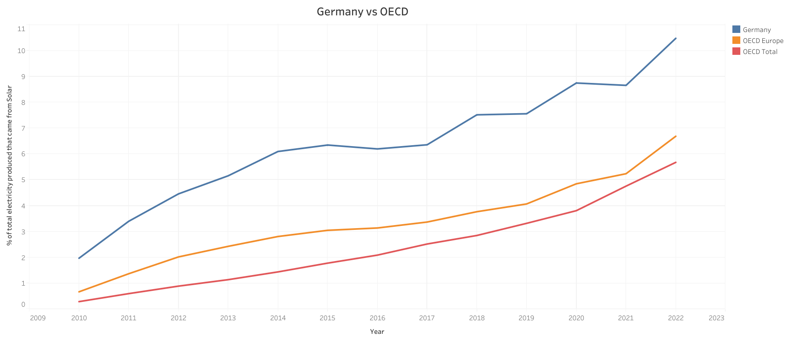

# Solar Energy in Germany

## 1. Data Source
- [Monthly Electricity Production in GWh 2010-2022](https://www.kaggle.com/datasets/ccanb23/iea-monthly-electricity-statistics?resource=download)

## 2. Questions to answer
1. What percentage of Germany's total electricity production came from solar energy between 2010 and 2022, and how do these figures deviate from the OECD average?
2. Out of the countries for which we have data, which ones generated a higher percentage of solar energy relative to their total generated energy between 2017 and 2022?

## 3. Step-by-step procedure

**3.1. Comprehensive exploration of the data**

In order to understand the structure of the data and prepare for the analysis I used some basic SQL queries and came to the following conclusions:
- The "VALUE" column shows the numerical data with which we can work in decimal form and with GWh as the unit of measure. This value is always associated with a particular "PRODUCT" in a particular "MONTH" of a particular "YEAR" in a particular "COUNTRY". 
- The "PRODUCT" column determines what type of parameter the value in the "VALUE" column refers to. There are a total of 27 different types of "PRODUCT" and some examples are "Total exports", "Distribution losses", "Wind", "Oil", "Used for pumped storage", "Renewables", etc. The only ones of interest for the project are "Net electricity production" and "Solar" so we will need to filter the data in order to only get the results for these two types of "PRODUCT".
- The "share" column shows the percentage of the "Net electricity production" which each value in the "VALUE" column represents (for the rows where "PRODUCT" = "Net electricity production", the value in the column "share" is 1). Since we want to obtain the data annually instead of monthly, this column will not help us as much as we might intuitively think. If we were to average the monthly values in this column we would not get the real annual share value, as the monthly values would not be properly weighted. For example, the value corresponding to the month in which the "Net electricity production" is the maximum should have more weight in the annual average than the value corresponding to the month in which the "Net electricity production" is the minimum. The way to correctly make the annual share is to add up all the monthly values and then make the percentage of the two totals.
- In the column "COUNTRY" we find values such as "OECD Total", "IEA Total", "OECD Americas", "OECD Europe" or "OECD Asia Oceania". We will exclude them when working on question 2 as they are sets of countries rather than specific countries.
- The columns "TIME" and "TIME_CODE" show a unique code representing a specific month of a given year (Example: "JANUARY2010" for January 2010). This can help us in the following steps, as it enables us to distinguish between the same month of different years.

**3.2. Data Cleaning and Verification (SQL BigQuery)**

- Question 1: "Germany", "OECD Europe" and "OECD Total" have data for "Solar" and "Net electricity production" for all months between 2010 and 2022, and in none of the cases, the value is 0 [(Query 1)](sql_queries.txt).
- Question 2: Out of the 52 countries, only 50 of them have complete data about "Solar" and "Net electricity production" for each month between 2017 and 2022. We will exclude the ones with incomplete data for the analyisis: Costa Rica nad Iceland. [(Query 2)](sql_queries.txt).

**3.3. Analysis and creation of the necessary tables for visualization (Python Pandas)**

- Question 1: Create a table comparing the share of the total electricty production that solar energy represented for "Germany", "OECD Europe" and "OECD Total" between 2010 and 2022 [(Script 1)](Q1.py).
- Question 2: Create a table showing how much electricity each country produced between 2017 and 2022 both in total and from solar energy, along with a column reflecting the percentage of the share that solar energy represented [(Script 2)](Q2.py).

## 4. Results

## 5. Conclussions
