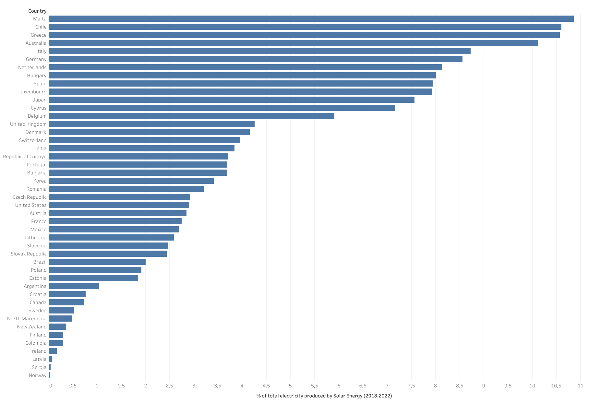

# Solar Energy in Germany

## 1. Primary objective and specific questions to answer
The primary objective of the project is to assess the developement of solar energy in Germany in comparison to the global context. To achieve this, the following questions will be addressed: 
1. What percentage of Germany's total electricity production came from solar energy between 2010 and 2022, and how do these figures deviate from the OECD average?
2. Out of the countries for which we have data, which ones generated a higher percentage of solar energy relative to their total generated energy between 2017 and 2022 and where does this comparison leave Germany?

## 2. Data Source
- [Monthly Electricity Production in GWh 2010-2022](https://www.kaggle.com/datasets/ccanb23/iea-monthly-electricity-statistics?resource=download)

## 3. Step-by-step procedure

**3.1. Comprehensive exploration of the data**

In order to understand the structure of the data and prepare for the analysis some basic SQL queries were used, leading to the following conclusions:
- The "VALUE" column shows the numerical data with which we can work in decimal form and with GWh as unit of measure. This value is always associated with a particular "PRODUCT" in a particular "MONTH" of a particular "YEAR" in a particular "COUNTRY". 
- The "PRODUCT" column determines what type of parameter the value in the "VALUE" column refers to. There are a total of 27 different types of "PRODUCT". Some examples are "Total exports", "Distribution losses", "Wind", "Oil", "Used for pumped storage", "Renewables", etc. The only ones of interest for the project are "Net electricity production" and "Solar" so it will be necessary to filter the data in order to only get the results for these two types of "PRODUCT".
- The "share" column shows the percentage of the "Net electricity production" which each value in the "VALUE" column represents (for the rows where "PRODUCT" = "Net electricity production", the value in the column "share" is 1). Since rows are associated with months and we want to obtain the data annually instead of monthly, this column will not be as helpful as we might intuitively think. If we were to average the monthly values in this column we would not get the real annual share value, as the monthly values would not be properly weighted. For example, the value corresponding to the month in which the "Net electricity production" is the maximum should have more weight in the annual average than the value corresponding to the month in which the "Net electricity production" is the minimum. The way to correctly make the annual share is to add up all the monthly values and then make the percentage of the two totals.
- In the column "COUNTRY" there are values such as "OECD Total", "IEA Total", "OECD Americas", "OECD Europe" or "OECD Asia Oceania". These values will be excluded when working on question 2 as they are sets of countries rather than specific countries.
- The columns "TIME" and "TIME_CODE" show a unique code representing a specific month of a given year (Example: "JANUARY2010" for January 2010). This can be helpful in the following steps, as it allows to distinguish between the same month of different years.

**3.2. Data verification (SQL BigQuery)**

After becoming acquainted with the dataset, the next step was taken to verify the availability of necessary data to address the research questions. Utilizing SQL queries in BigQuery, the following conclusions were reached:
- Question 1: "Germany", "OECD Europe" and "OECD Total" have data for "Solar" and "Net electricity production" for all months between 2010 and 2022, and in none of the cases, the value is 0. [(Query 1)](code/SQL_queries.txt)
- Question 2: Out of the 52 countries, only 50 of them have complete data about "Solar" and "Net electricity production" for each month between 2017 and 2022. We will exclude the ones with incomplete data for the analyisis: Costa Rica and Iceland. [(Query 2)](code/SQL_queries.txt)

**3.3. Data manipulation and creation of the necessary tables (Python Pandas)**

In this step, Python pandas library was utilized to filter and manipulate the data, enabling the extraction of the two dataframes needed to effectively answer the questions:
- Question 1: Creation of a table comparing the share of the total electricty production that solar energy represented for "Germany", "OECD Europe" and "OECD Total" between 2010 and 2022. [(Script 1)](code/Q1.py)
- Question 2: Creation of a table showing how much electricity each country produced between 2017 and 2022 both in total and from solar energy, along with a column reflecting the percentage of the share that solar energy represented. [(Script 2)](code/Q2.py)

**3.4. Creation of the visualizations (Tableau)**

With the .csv files obtained in the previous step as the data source, two visualizations were created in Tableau to view the results graphically. These visualizations can be seen both in my [Tableau Public profile](https://public.tableau.com/app/profile/enrique.de.sus/vizzes) and in the next section of this report.

## 4. Results

Visualization related to question 1: % of total electricity production that came from Solar Energy in Germany, OECD Europe and OECD Total (2010-2022)

[*Interactive Vizz in Tableau public*](https://public.tableau.com/app/profile/enrique.de.sus/viz/GermanyvsOECD_17129401671640/Hoja2)

Visualization related to question 2: % of total electricity production that came from Solar Energy in the countries in the countries for which we have data (2018-2022)
 

[*Interactive Vizz in Tableau public*](https://public.tableau.com/app/profile/enrique.de.sus/viz/totalelectricityproducedbySolar/Hoja1)

## 5. Conclussions

The overall conclusion is that Germany is quite advanced in solar energy on the international scene. Of the 50 countries for which we have data, it ranks sixth with the highest percentage of energy production coming from the sun. It should also be noted that the five countries ahead of it are countries with the greatest solar potential due to their geography, which makes this sixth place even more meritorious.

The comparative graph with the OECD shows that Germany was already in a good position in 2010, which may be due to faster growth than other countries in the years prior to 2010 or simply to the fact that Germany began to support solar energy earlier. To clarify this doubt we would need access to data prior to 2010. However, since 2010 the growth of the solar industry in Germany has been higher than in other countries of the OECD and the gap has only become larger. This leads us to the conclusion that Germany's advantageous position today is not only due to a better starting point but also to a strong commitment to solar energy growth in recent years.
